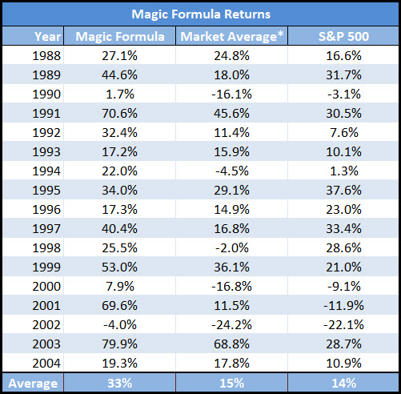

# Value Investing
value investing using python and yahoo finance

## Why am I doing this project?

### The main goal of this project is to identify the stocks that are undervalued in the market

<i> You should buy dollar for sixtysix cents - warren buffet </i>
<i> Price is what you pay value is what you get - warren buffet </i>

 We often hear from several people the phrase that is very commonly hear "BUY THE DIP" well how do we exactly know
    when a stock is at its low or high 
 

## How to figure out if the stock is a good buy or not ?

### We will be using joel greenblatt's magic formula to rank the stocks and pick the top 1-3 stocks every month 
### and rebalance the portofolio at the end of every year

### This investment strategy has been backtested in the past and has been proven to beat the market

-> Link to the article.